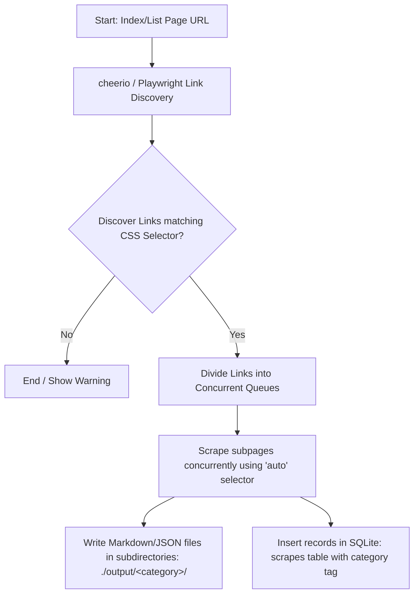

# Crawl & Category Scraping Architecture

To support hierarchical site structure extraction (such as gathering all articles inside a blog or news subcategory), **Scrapi** implements a unified **Crawl & Category Scraping** subsystem. This allows users to discover nested links from a list/index page and scrape them concurrently under a designated category tag.

---

## 🏗️ Core Mechanics

The category scraping system bridges visual selector extraction, database tagging, and hierarchical output organization:



### 1. Database Schema Extensions & Migrations
On boot, the database schema is automatically updated to add a `category` column to the historical `scrapes` logs table:
- **Automatic Migration**: `storage.js` prepares a lightweight SQLite migration script checking if the `category` column is absent and automatically executes `ALTER TABLE scrapes ADD COLUMN category TEXT` to preserve existing scraper records.
- **Category Filter Queries**: `getAllScrapes(categoryFilter)` retrieves scrapes matching only a specific category to support cleaner audit trails in the UI and CLI history.

### 2. Hierarchical File Storage
When a scrape option includes `category`:
- Outputs are routed to subdirectory folders under the output folder: `./output/<category_name>/filename.md` and `./output/<category_name>/filename.json`.
- Missing directories are recursively created on-the-fly.

---

## 💻 CLI Integration

### 1. The `crawl` Command
The terminal tool exposes a dedicated `crawl` subcommand to fetch a listing index page, parse matching anchors, and execute polite parallel scrapers:

```bash
node src/cli.js crawl <url> -s <selector> --category <name> [options]
```

#### Key Options:
- `-s, --selector <css>` (Required): The selector for anchor elements on the listing page (e.g., `".post-link"` or `"a.story-title"`).
- `--category <name>`: Tags all crawled subpages under a specific category and writes files into `./output/<category>/`.
- `-c, --concurrency <number>`: Determines how many parallel worker queues fetch pages (default: `2`).
- Supports all standard scraping options (`--images`, `--llm`, `--summarize`, `--schema`, etc.).

#### Example:
```bash
node src/cli.js crawl https://news.ycombinator.com -s ".titleline > a" --category TechNews --concurrency 3
```

### 2. Listing & Filtering Scrapes by Category
Query history logged under specific categories:

```bash
node src/cli.js list --category TechNews
```

---

## 🖥️ Web Console Integration

The Visual Web Console integrates these capabilities dynamically:

1. **Category Tagging**: A new **Category** text input field is provided under the targeting pane. Tagging works for both standard individual pages and batch inputs.
2. **Batch Link Discovery Scrapes**: When a selector is extracted from the web view, you can click **Discover Links**. Once links are resolved, click **Start Live Batch Scrape** to watch parallel progress in real-time.
3. **Category Filtering**: An interactive text input **Filter by Category** allows you to search and filter sqlite records matching specific categories on the fly, rendering corresponding category badges.
