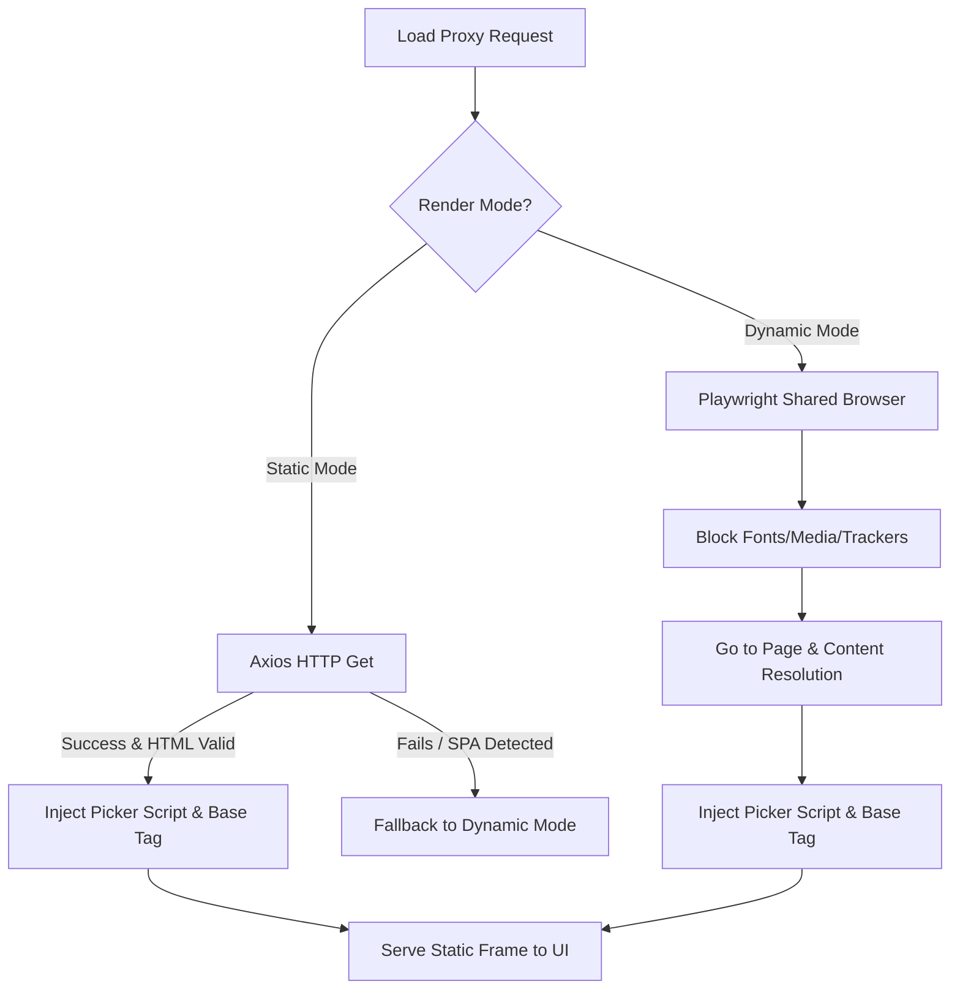

# Dual-Mode Rendering (Hybrid Proxy) Architecture

To minimize local CPU usage, system RAM consumption, and startup latency on macOS hosts, **Scrapi** implements a **Dual-Mode Rendering Engine** (Hybrid Proxy).

---

## 🏗️ The Problem: Headless Browser Overhead

Visual element picking requires loading target web pages within a proxy context. Standard scrapers always launch a headless browser (like Playwright/Chromium) to load and render these target pages. 

While necessary for dynamic Single Page Applications (SPAs) built with React, Vue, or Angular, running Chromium is extremely expensive:
* **High Memory Usage**: Spawns multiple OS processes consuming 150MB - 300MB of RAM per context.
* **CPU Spikes**: Booting and rendering dynamic pages causes host CPU utilization spikes on macOS.
* **Latency**: Pre-warming helps, but browser loading, layout recalculation, and page content resolution typically take 2–5 seconds per URL.

---

## 🔄 The Solution: Axios-First Hybrid Proxy

The Dual-Mode Rendering Proxy optimizes resource usage by separating requests into static and dynamic execution streams:

### 1. Static Mode (Fast & Light)
* **Execution**: Fetches the HTML of the target URL using a standard `axios` HTTP request.
* **Overhead**: Almost zero CPU load and <10ms database/memory impact.
* **Transformation**: Resolves relative elements with `<base>`, strips Content-Security-Policy rules, injects `picker.js`, and serves the static HTML directly.
* **Speed**: Content loads in under **100ms** (up to a **90% reduction** in latency).

### 2. Automatic SPA Detection & Fallback
If the static load returns an empty layout containing SPA target points (such as `

` or `

`) without meaningful HTML size or static text content, the engine automatically catches this and falls back to dynamic mode.

### 3. Dynamic Mode (Browser Fallback)
* **Execution**: Opens page contexts inside the long-lived, pre-warmed background Chromium browser.
* **Optimization**: Requests for resource-heavy media types (images, videos, web fonts) and analytics tracker domains (Google Analytics, Facebook Pixel, etc.) are explicitly blocked at the browser routing layer to preserve bandwidth and RAM.

---

## 💻 UI Controls

In the React Visual Console, the user has a Segmented Toggle Bar to explicitly configure targeting modes:
* **Static Mode**: Indicated by `⚡ Static (Fast)`. Recommended for news sites, documentation, blogs, and static portfolios.
* **Dynamic Mode**: Indicated by `🌐 Dynamic (JS)`. Used for dynamic web applications, login dashboards, or infinite scroll content.
