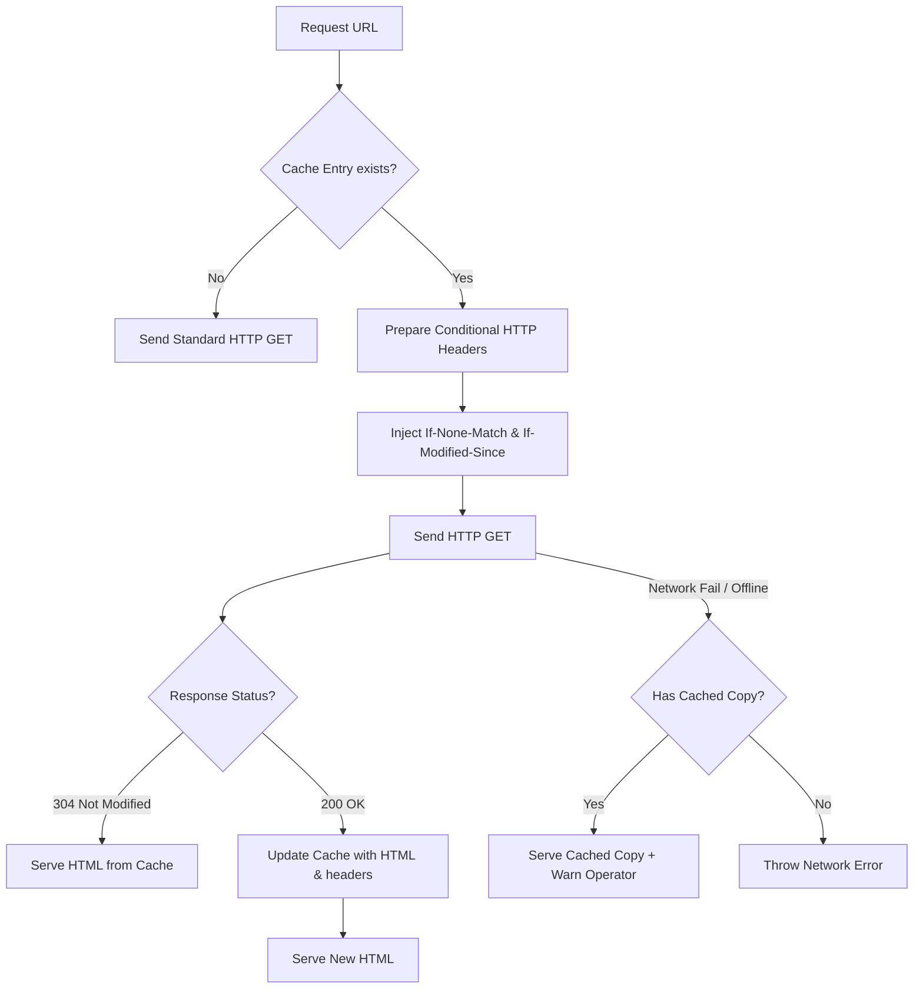

# Metadata-Aware HTTP Cache Architecture

To minimize network bandwidth usage, speed up execution, and reduce local and destination machine load, **Scrapi** implements an in-memory and SQLite-backed **Metadata-Aware HTTP Caching Layer**.

---

## 🏗️ How it Works

Scrapi stores cached web pages inside the local SQLite database (`http_cache` table) along with HTTP validation headers (ETag, Last-Modified):

```text
http_cache Table:
┌─────────────────┬──────────────────────┬─────────────┬───────────────────┬─────────────┐
│ url (PRIMARY KEY)│ html                 │ etag        │ last_modified     │ cached_at   │
├─────────────────┼──────────────────────┼─────────────┼───────────────────┼─────────────┤
│ https://foo.com │ <html>...</html>     │ "W/324a-.." │ "Mon, 08 Jun..."  │ ISO-Date    │
└─────────────────┴──────────────────────┴─────────────┴───────────────────┴─────────────┘
```

---

## 🔄 Conditional Request flow

When fetching page HTML:



### 1. Conditional Headers
If a cache record exists:
- Sets `If-None-Match` to the cached `etag` value.
- Sets `If-Modified-Since` to the cached `last_modified` value.

### 2. 304 Not Modified Optimization
If the destination server returns `304 Not Modified`, no body is downloaded. The scraper reads the content locally, saving bandwidth and parsing costs.

### 3. Offline Resilience
If a request fails due to lack of internet access or remote server downtime, the caching layer automatically serves the stale cached copy and logs a warning, preventing pipeline failure.

---

## 💻 Code Changes

- **[storage.js](file:///Users/alpha/Desktop/Project%20report/Scrapi/src/storage.js)**: Holds the `http_cache` table and defines database access helpers (`getCachedPage`, `saveCachedPage`).
- **[scraper.js](file:///Users/alpha/Desktop/Project%20report/Scrapi/src/scraper.js)**: Manages conditional requests, validates status headers, and saves results.
- **[cli.js](file:///Users/alpha/Desktop/Project%20report/Scrapi/src/cli.js)**: Exposes `--no-cache` to bypass caching.
