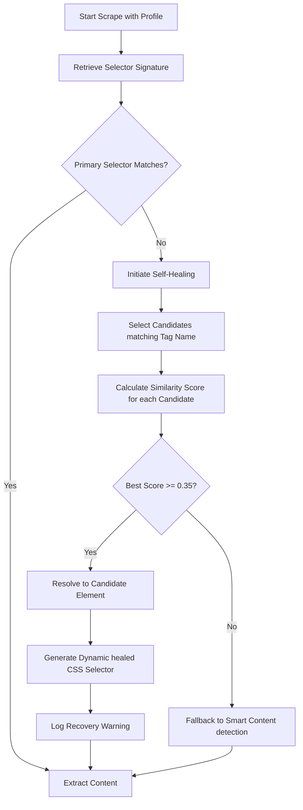

# Self-Healing Selector Architecture

Web scraping pipelines suffer heavily from **layout drift**. When target websites update their designs, hardcoded CSS selectors (like `div.content > ul > li:nth-child(2)`) break, causing data pipelines to fail. 

To address this, **Scrapi** implements a **Self-Healing Selector Architecture** that makes element targeting resilient to structural changes.

---

## 🏗️ How it Works

Instead of storing a single CSS selector string, Scrapi stores a **Selector Signature** composed of multiple anchors:

| Anchor | Description | Weight |
| :--- | :--- | :--- |
| **Primary Selector** | The original CSS selector generated during visual element picking. | *Primary Attempt* |
| **Element Tag Name** | The specific HTML tag name (e.g. `article`, `div`, `table`). | *Filter constraint* |
| **Text Content Snippet** | A sample of the text inside the targeted element when it was configured. | **50% of heuristic score** |
| **Class Names list** | The style classes originally attached to the element. | **30% of heuristic score** |
| **Parent Element Tag** | The immediate parent tag name. | **20% of heuristic score** |

---

## 🔄 The Self-Healing Loop

When a scraping operation is triggered using a named profile:

### 1. Primary Match
The scraper attempts to resolve the primary selector. If elements are found, it proceeds immediately.

### 2. Heuristic Candidate Scoring
If the primary selector fails (returns 0 elements), the self-healing routine is activated:
- Finds all elements in the DOM matching the targeted `tagName`.
- Computes a similarity score ($S$) from $0.0$ to $1.0$ for each candidate:
  $$S = \text{TextSimilarity} \times 0.5 + \text{ClassOverlap} \times 0.3 + \text{ParentAlignment} \times 0.2$$
  * *TextSimilarity*: Evaluates if candidate text contains the text snippet, or computes word intersection ratio.
  * *ClassOverlap*: Percentage of target classes matching the candidate classes.
  * *ParentAlignment*: $1.0$ if the candidate's parent matches the signature's `parentTagName`, otherwise $0.0$.

### 3. Threshold Resolution
The candidate with the highest similarity score $\ge 0.35$ is selected. A warning is logged to alert the operator, and the content is successfully scraped, preventing pipeline failure.

---

## 💻 Code Implementation

The self-healing logic is embedded within:
- **[picker.js](file:///Users/alpha/Desktop/Project%20report/Scrapi/src/ui/picker.js)**: Enriches the element click event to capture full metadata (classes, tags, parents, text snippets).
- **[index.html](file:///Users/alpha/Desktop/Project%20report/Scrapi/src/ui/index.html)**: Saves this signature structure into SQLite profile configs.
- **[scraper.js](file:///Users/alpha/Desktop/Project%20report/Scrapi/src/scraper.js)**: Runs the heuristic scoring candidate loops when selector elements are missing.
- **[cli.js](file:///Users/alpha/Desktop/Project%20report/Scrapi/src/cli.js)**: Runs the target signature lookups during `--profile` executions.
