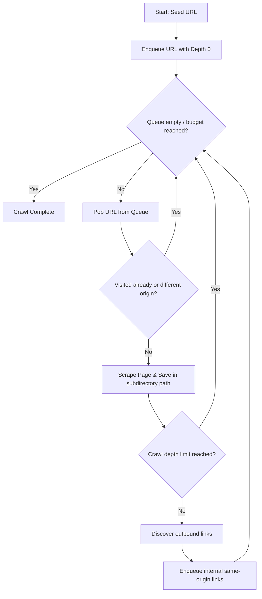

# Website Spidering & Recursive Crawling

To extract entire sites or wiki sections, **Scrapi** includes a robust **Website Spidering Engine**. It performs a recursive breadth-first traversal of internal links, constrained strictly to the same origin, mapping the scanned site structure directly onto your local filesystem.

---

## 🏗️ Architecture & Path Translation

The spider parses page content, resolves relative paths to absolute URLs, identifies outgoing link anchors, and queues internal pages for scraping.



### 1. Same-Origin Constraint
To prevent the crawler from sliding off the target website onto external domains, link discovery is filtered strictly to the domain/origin of the seed URL (same protocol, host, and port).

### 2. Physical Folder Layout mapping
Instead of dump files in a flat folder, Scrapi translates target URL paths into matching safe local subdirectories:
- **Seed URL**: `https://example.com` -> saved to `./output/example.com/index.md`.
- **Subpages**: `https://example.com/about/team` -> saved to `./output/example.com/about/team.md`.
- **Trailing slashes**: `https://example.com/blog/` -> saved to `./output/example.com/blog/index.md`.
- **Collision Avoidance**: If query strings or paths result in matching target basenames, Scrapi detects the duplicate path and appends a numeric counter (e.g., `products_1.md`, `products_2.md`) to preserve files.

---

## 💻 CLI Command: `spider`

Use the `spider` command to scrape whole sites from the terminal.

```bash
node src/cli.js spider <seed-url> [options]
```

### Subcommand Parameters:
* `-o, --output <dir>`: Base directory to save markdown outputs (default: `./output`).
* `-c, --concurrency <number>`: Number of parallel worker threads (default: `2`).
* `-d, --depth <number>`: Maximum crawl depth recursion limit (default: `Infinity`).
* `-m, --max-pages <number>`: Scraping budget limit to protect disk space (default: `100`).
* `--delay <ms>`: Polite rate-limiting delay between requests per worker (default: `1500` ms).
* `--category <name>`: Scrapes table logging category (defaults to domain hostname).
* Supports all standard scraping options (`--images`, `--no-meta`, `--llm`, etc.).

### Example:
```bash
node src/cli.js spider https://example.com -m 50 --concurrency 3 --delay 1000
```

---

## 🖥️ Web Console Integration

The Visual Web Console provides a dedicated control tab for spider jobs:

1. **Tab Selector**: Toggle the sidebar selector mode to **🕸️ Spider**.
2. **Parameters Panel**: Configure Crawl Depth, Max Page Budget, Concurrency, and Rate Limit Delay.
3. **Crawl Statistics**: Real-time stats showing visited pages, remaining queue, succeeded pages, and failed pages.
4. **Live Scroll Logs**: A scrollable log terminal output reflecting crawler operations dynamically.
5. **Abort Signal**: A **Cancel Spider Crawl** button to gracefully terminate background workers instantly.
